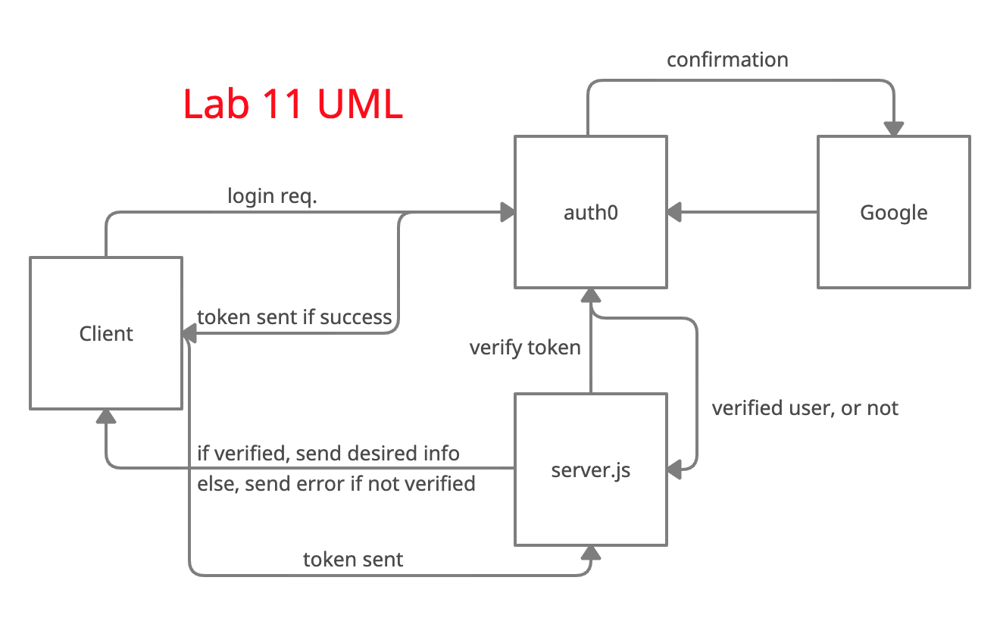

# Current Lab: 12

**Author**: Mark Thanadabouth

**Version**: 1.0.0 (increment the patch/fix version number if you make more commits past your first submission)

## Overview
This is where the frontend lives for Can of Books starter code.

## Getting Started
Refer to trello cards.
> [Trello Board](https://trello.com/b/LhHdaHUV/301n22-bestbookstasktracker)

## Architecture
React, JavaScript, Auth0

## Change Log
- (08/16) Finished Lab11

## Credit and Collaborations
- Clarissa P, Alex P, Phil M, JP J,

## UML
> 

### Lab: 11

Name of feature: User Authentication with Auth0

Estimate of time needed to complete: 2 hours

Start time: 2:30pm

Finish time: 6:00pm(08/16)

Actual time needed to complete: 6 hours

### Lab: 12

Name of feature: Storage/MongoDB

Estimate of time needed to complete: 6 hours

Start time: 

Finish time: 

Actual time needed to complete:

*Logistical*

> What hours will you be available to communicate?

- 1pm-10pm

> What platform will you use to communicate (ie. Slack, phone …)?

- Slack

> How often will you take breaks?

- Every hours or so.

> What is your plan if you start to fall behind?

- Ask for help.

*Cooperative*

> Make a list of each person’s strengths.

- Disciplined with tasks and google skills.

> How can you best utilize these strengths in the development of your application?

- To try to solve the problem ourselves first.

> In what areas do you each want to develop greater strength?

- Comfortable with being uncomfortable.

> Knowing that every person in your team needs to understand the code, how do you plan to approach the day-to-day development?

- Whatever a person does, make sure the partner understands what they just did.

*Conflict Resolution*

> What will your team do if one person is pulling all the weight while the other person is not contributing?

- Communicate.

> What will your team do if one person is taking over the project and not letting the other member contribute?

- This will be limited by our communication.

> How will you approach each other and the challenge of building an application knowing that it is impossible for two people to be at the exact same place in understanding and skill level?

- Utilizing resources that we have such as other students, intructor, and TA's. Timeboxing when needed.

# Start your own "Can of Books" App

This repository has starter code to begin work on creating your own online bookshelf.

## What can books do?

Books are life-changing. They have the power to enlighten, educate, entertain, heal, and help us grow. Build out this code base to create an web app to track what books have impacted you, and what's recommended to read next.

## Use this template

Clone this repo to your own account with the green "Use this template" button. Then, add any collaborators. Now you are ready to start adding features! Deploy your site to let the world know which books have had the greatest impact on you, and what's recommended. Enjoy!
